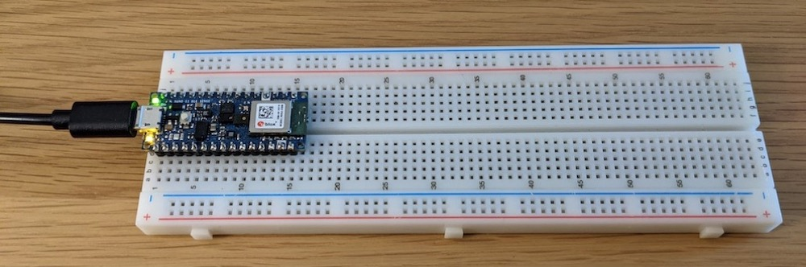

# Tiny Trainable Instruments - Technical details

For building the instruments, participants receive a materials kit consisting of off-the-shelf components, each of them with their original packaging from the manufacturer.

The instruments are built by placing the Arduino microcontroller on the solderless breadboard, and by making connections with jumper wires to different low-voltage components for multimedia output, in particular a piezo buzzer for sound, and a micro servo motor for movement.

All connections we are making and all the parts are being used as instructed and recommended by their manufacturers. All the products are off-the-shelf and commercially available, and we are not introducing any modifications to them.

## Materials origin

The Arduino microcontrollers are made in Italy and shipped from their USA warehouse, and purchased directly from their USA online store available at [https://store.arduino.cc/usa/](https://store.arduino.cc/usa/). All the other materials are acquired from Adafruit, a popular online store for beginners, students, and artists, shipped from their New York City USA warehouse, available at [https://www.adafruit.com/](https://www.adafruit.com/).

## Power supply

The participants power their instruments with an USB cable connected to their computers, which operates at 5 Volts. The Arduino microcontroller we are using converts this power source to 3.3 Volts for its internal operation, and provides that voltage to the rest of the instrument.

We use the LEDs on the Arduino microcontroller as a visual cue that we use to make sure that the instrument is powered and working.

With that are using a very safe power supply, with the flow of power starting with our computer's power supply, going through the computer, then the USB cable, and finally our instrument. Each one of these stages limits the voltage and current to safe levels, and also feature surge protections that shut down when there is an incorrect use in our instrument, so that the risk involved is minimal.

All the connections we are doing are made with safe jumper wires, on a stable breadboard, and following popular procedures performed by students and beginners in similar educational contexts, so electrocution and fire are not risks.

The breadboard and all the components we are using are tolerant to wrong connections, and will not work or shut down when a wrong connection is made, with no harm for the user, their computer, their instrument, or their surroundings.
