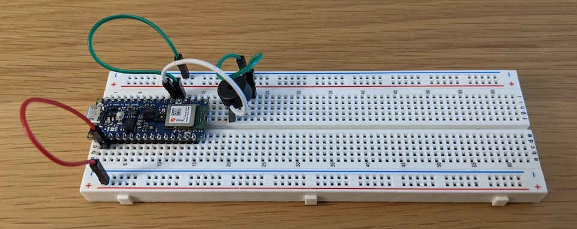
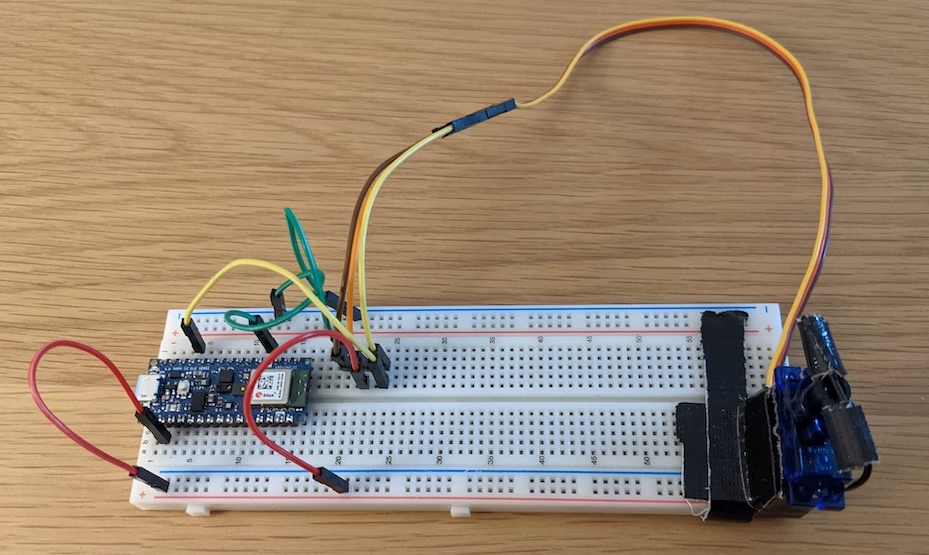
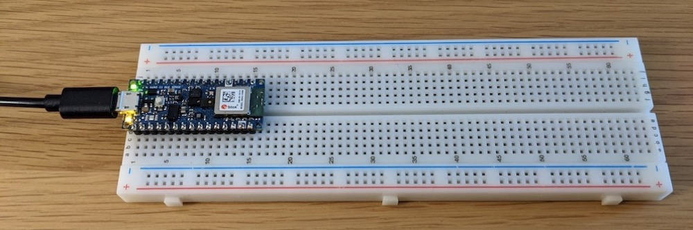

# Tiny Trainable Instruments - Technical details

For building the instruments, participants receive a materials kit consisting of off-the-shelf components, each of them with their original packaging from the manufacturer.

The instruments are built by placing the Arduino microcontroller on the solderless breadboard, and by making connections with jumper wires to different low-voltage components for multimedia output, in particular a piezo buzzer for sound, and a micro servo motor for movement.

All connections we are making and all the parts are being used as instructed and recommended by their manufacturers. All the products are off-the-shelf and commercially available, and we are not introducing any modifications to them.

## Materials origin

The Arduino microcontrollers are made in Italy and shipped from their USA warehouse, and purchased directly from their USA online store available at [https://store.arduino.cc/usa/](https://store.arduino.cc/usa/). All the other materials are acquired from Adafruit, a popular online store for beginners, students, and artists, shipped from their New York City USA warehouse, available at [https://www.adafruit.com/](https://www.adafruit.com/).

## Power supply

The participants power their instruments with an USB cable connected to their computers, which operates at 5 Volts. The Arduino microcontroller we are using converts this power source to 3.3 Volts for its internal operation, and provides that voltage to the rest of the instrument.

We use the LEDs on the Arduino microcontroller as a visual cue that we use to make sure that the instrument is powered and working.

With that are using a very safe power supply, with the flow of power starting with our computer's power supply, going through the computer, then the USB cable, and finally our instrument. Each one of these stages limits the voltage and current to safe levels, and also feature surge protections that shut down when there is an incorrect use in our instrument, so that the risk involved is minimal.

All the connections we are doing are made with safe jumper wires, on a stable breadboard, and following popular procedures performed by students and beginners in similar educational contexts, so electrocution and fire are not risks.

The breadboard and all the components we are using are tolerant to wrong connections, and will not work or shut down when a wrong connection is made, with no harm for the user, their computer, their instrument, or their surroundings.

# Tiny Trainable Instruments - Detalles técnicos

Para construir los instrumentos, los participantes reciben un kit de materiales que consiste en materiales disponibles comercialmente en tiendas, cada uno en su paquete original directo desde el fabricante o distribuidor.

Los instrumentos son construidos con el microcontrolador Arduino que se conecta al protoboard electrónico, y haciendo conexiones con cables a otros componentes de bajo voltaje para hacer respuestas multimedia, en particular un zumbador piezoelectrónico para emitir sonido, y un micro motor servo para emitir movimiento.

Todas las conexiones realizadas y todas las partes están siendo usadas tal como es recomendado y enseñado por sus fabricantes. Todos los productos están disponibles en el comercio y no estamos haciendo ninguna modificación.

## Origen de los materiales

Los microcontroladores Arduino son fabricados en Italia y son enviados desde su distribuidor en Estados Unidos, y adquiridos directamente desde su tienda web en Estados Unidos, disponible en [https://store.arduino.cc/usa/](https://store.arduino.cc/usa/). Todos los otros materiales son adquiridos en Adafruit, una popular tienda en lína para principiantes, estudiantes y artistas, y son enviados desde su bodega en New York City Estados Unidos, y disponibles en [https://www.adafruit.com/](https://www.adafruit.com/).

## Fuente de poder

Los participantes usan como fuente de poder el cable USB conectado a sus computadores, el que opera a 5 Volts. El microcontrolador Arduino convierte esta fuente de poder a 3.3 Volts para su operación interna, y provee ese voltaje al resto del instrumento.

Usamos las luces LED en el microcontrolador Arduino como una confirmación visual para confirmar que el instrumento está encendido y funcionando.

Con esto, estamos usando una fuente de poder muy segura, donde el flujo de poder empieza en la fuente de poder de nuestro computador, pasa a través del computador, luego el cable USB, y finalemnte nuestro instrumento. Cada una de estas etapas limita el voltage y la corriente a niveles seguros, y también proveen mecanismos de seguro ante subidas súbitas que se apagan cuando hacemos un uso incorrecto de nuestro instrumento, por lo que el riesgo es mínimo.

Todas las conexiones que estamos haciendo son realizadas con cables seguros y aislados, en un protoboard electrónico estable, y siguiendo procedimientos populares hechos por estudiantes y principiantes en contextos educacionales simialres, así que no existen riesgos de electrocución ni de incendios.

El protoboard electrónico y todos los componentes que stamos usando son tolerantes a conexiones equivocadas, y no funcionarán o se apagarán cuando se haga una mala conexión, sin dañar al usuario, su computador, su instrumento, o su entorno.
