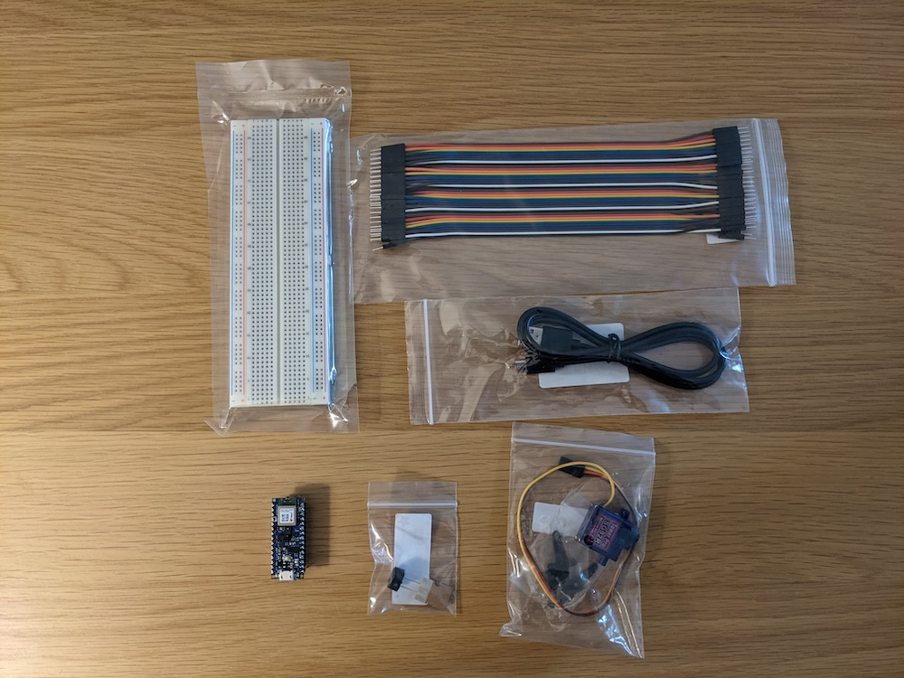
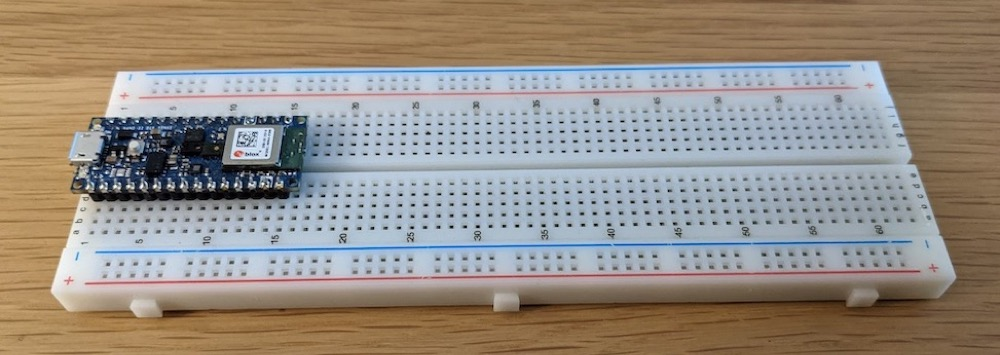

# Tiny Trainable Instruments - Guía de usuario

## Materiales

Los participantes de este estudio recibirán un kit con estos 6 materiales para construir tus Tiny Trainable Instruments:

1. 1x microcontrolador Arduino Nano 33 BLE Sense con pins
2. 1x Cable Micro USB
3. 1x Protoboard electrónico
4. 1x Paquete de cables
5. 1x Micro motor servo
6. 1x Zumbador piezoeléctrico

## Montaje

Durante el taller, colocaremos el microcontrolador Arduino en el protoboard electrónico, para hacer todas las conexiones de forma fácil y segura.

Usaremos el cable USB como fuente de poder y para subir código desde nuestros computadores. Cuando el microcontrolador Arduino está encendido, sus LEDs se iluminan.

Durante el taller construiremos 2 instrumentos con los mismos materiales: el primero usa el zumbador piezoeléctrico para emitir sonido, y usamos 4 cables para hacer las conexiones.

El otro instrumento usa un motor servo para emitir movimiento, y necesitamos 8 cables para construirlo.

## Instalación

Para este estudio los participantes instalarán en sus computadores software gratuito y de fuente abierta de Arduino y míos, accederán al servicio en la nube gratuito Google Colab para entrenar algoritmos de aprendizaje de máquinas, e instalarán el navegador web Google Chrome.

### Paso 1

Instala en tu computador el software editor oficial gratuito y de fuente abierta de Arduino, disponible en el sitio web  [https://www.arduino.cc/en/software](https://www.arduino.cc/en/software), para computadores Linux, Mac, y Windows.

### Paso 2

Instala las bibliotecas de software gratuitas y de fuente abierta para el microcontrolador que estamos usando, Arduino Nano 33 BLE Sense, siguiendo la guía rápida oficial de Arduino, disponible en [https://docs.arduino.cc/software/ide-v1/installing-mbed-os-nano-boards](https://docs.arduino.cc/software/ide-v1/installing-mbed-os-nano-boards).

### Paso 3

Instala la biblioteca de software gratuita y de fuente abierta construida para este proyecyo, disponible directamente desde el editor de Arduino con el nombre TinyTrainable, y también desde el sitio web [https://github.com/montoyamoraga/TinyTrainable](https://github.com/montoyamoraga/TinyTrainable).

### Paso 4

Para este estudio, necesitas una cuenta gratuita de Google, para así poder correr algoritmos de aprendizaje de máquinas usando el servicio gratuito Google Colaboratory, también conocido como Google Colab. Más información disponible en [https://research.google.com/colaboratory/faq.html](https://research.google.com/colaboratory/faq.html)

### Paso 5

Instala en tu computador el navegador web Google Chrome , disponible en [https://www.google.com/chrome/](https://www.google.com/chrome/).
