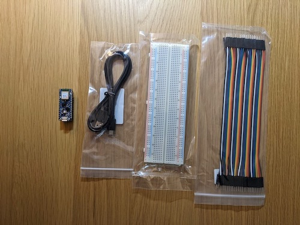
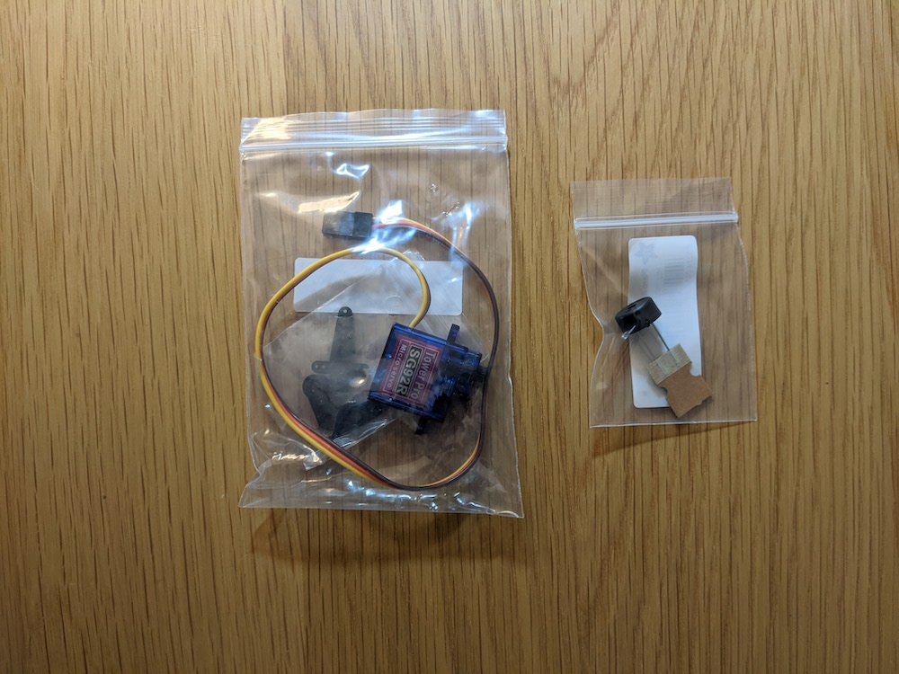

# Tiny Trainable Instruments - User Guide

## You will get these materials on the mail

Your materials:

* 1x Arduino Nano 33 BLE Sense microcontroller with headers
* 1x Solderless breadboard
* 1x Micro USB Cable
* 1x Piezo buzzer
* 1x Micro servo motor

Assembly:

Place the Arduino microcontroller on the breadboard
