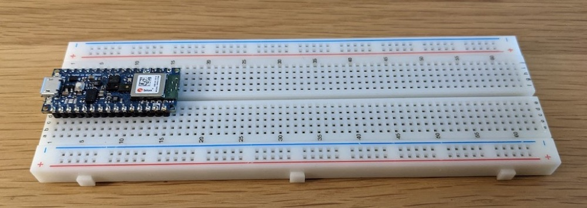

# Tiny Trainable Instruments - User Guide

## Materials

Participants of the study will will get these 6 minimum materials for building your Tiny Trainable Instruments:

1. 1x Arduino Nano 33 BLE Sense microcontroller with headers
2. 1x Micro USB Cable
3. 1x Solderless breadboard
4. 1x Pack of jumper wires
5. 1x Micro servo motor
6. 1x Piezo buzzer

## Assembly

During the workshop, we will place the Arduino microcontroller on the solderless breadboard, to make all the connections in a safe and easy way.

We will use the USB cable to both power our circuits and to be able to upload code from our computers.

When we connect the Arduino microcontroller to the USB port on our computers, its LEDs will light up.

During the workshop we will assemble 2 circuits: the first one involves the piezo buzzer, and it involves 4 jumper wires.

The other circuit is for the servo motor and it involves 8 jumper wires.

## Installation

For this study the participants will install free open source software on their computer.

* Arduino IDE
