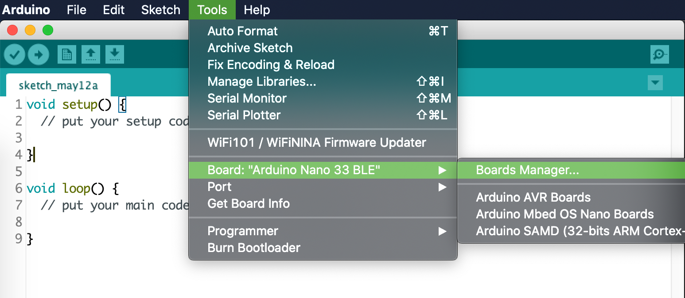
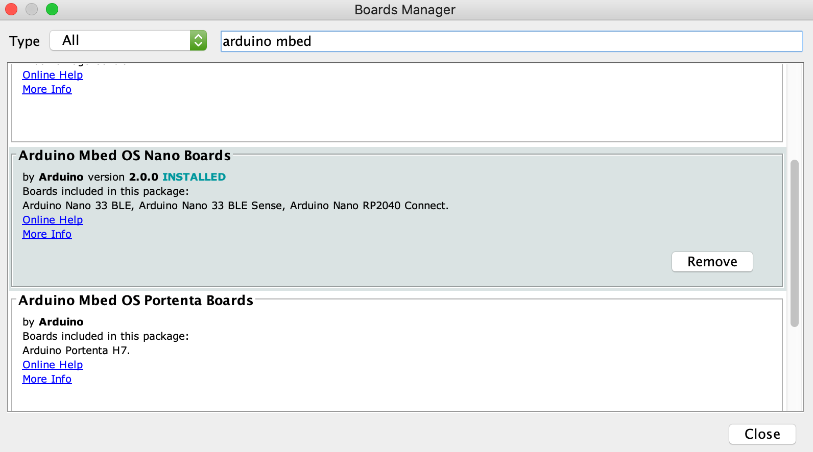
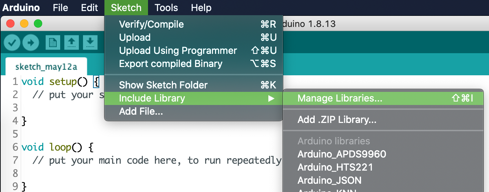

# Installation

Hi! Welcome to our installation guide, we're super glad to have you here :)

This guide includes information as of May 2021, and we will explicitly include the software versions we are using.

For additional documentation, please visit the official Arduino docs website at https://docs.arduino.cc, and in particular the documentation of the Arduino Nano 33 BLE Sense microcontroller at https://docs.arduino.cc/hardware/nano-33-ble-sense.

## Arduino IDE

First, download the Arduino Desktop IDE, available at https://www.arduino.cc/en/software. Select the stable release corresponding to your computer's operating system.

As of May 2021, we are using Arduino IDE 1.8.13.

## Arduino board

Now we need to install the core and necessary libraries for the Arduino Nano 33 BLE Sense. Open the Arduino IDE and navigate on the menu to:

```
Tools > Board: "<board_name>" > Boards Manager...
```



<!-- Guillermo: this image may induce to confusion since it already says Board: "Arduino Nano 33 BLE", and we are supposedly installing it -->

Now we will install the corresponding core for our board manager, this might take a while. Go to the search bar and type the following, then hit install. Please note that as of May 2021, we are using version 2.0.0.

```
Arduino Mbed OS Nano Boards
```



After the installation is complete, select the board we are going to work with (Arduino Nano 33 BLE) selecting the following options form the `Tools` menu:

```
Tools > Board: "<board_name>" > Arduino Mbed OS Nano Boards > Arduino Nano 33 BLE
```

Not that this option is valid for both Arduino Nano 33 BLE, and for the board we are using, the Arduino Nano 33 BLE Sense.

## Arduino libraries

Next we will install all the libraries needed for this project. On the Arduino IDE, navigate on the menu to

```
Tools > Manage Libraries... >
```



Next, search for `TinyTrainable` library for this project.This installation will give you the option to also install its dependencies, select `Install all` to additionally download these libraries:

* Libraries for using the embedded sensors of our microcontroller:
    * `Arduino_APDS9960`: color, proximity
    * `Arduino_LSM9DS1` acceleration, magnetic field, gyroscope orientation
* Libraries for machine learning:
    * `Arduino_KNN`: k-nearest neighbor algorithm.
    * `Arduino_TensorFlowLite`: microcontroller version of the TensorFlow machine learning library. Please download the latest non-precompiled version.
* Libraries for multimedia output:
    * `Adafruit GFX Library`: for output with screen.
    * `Adafruit SSD1306`: for output with screen.
    * `Adafruit Thermal Printer Library`: for outputs with thermal printer.
    * `Servo`: for output with servo motors.

## Test Arduino installation

To test if all dependencies were installed successfully, we will run our first code example. Please note that we will follow the same steps for all the other examples :)

First connect your Arduino Nano 33 BLE Sense to your computer with a USB micro cable, and navigate to  `File > Examples > TinyTrainable > check_serial`.

We will use two buttons on the Arduino IDE with our code: Compile and Upload.

We recommend first clicking on Compile, which will translate our source code to machine code that the Arduino microcontroller understands, and save that result in our computer.

Then, we can click the button Upload, which will send this machine code to the Arduino microcontroller.

Now we will open our Serial Monitor, to read the messages that the Arduino will send us, and also see its LEDs which will cyle through different colors.

If you still have questions about setting up the microcontroller, the full startup guide is available [here](https://www.arduino.cc/en/Guide/NANO33BLESense).


## input-color installation


## Python for machine learning

For input-color, you only need Arduino libraries. For input-gesture and input-speech, we need to create databases and train algothitms on a computer. For that, you can choose between using the cloud service Google Colab, or you can also use your own machine.

In your machine, the software we will need inlcudes Python, TensorFlow and Jupyter.

Your computer might have Python already installed, and it might be one that is not compatible with the TensorFlow version we are using.

These are the versions we will be using, as of May 2021:

* Python 3.8.6
* TensorFlow 2.3.2
* Jupyter Lab 3.0.5

In order to be able to manage different versions of Python, we suggest installing the tool pyenv https://github.com/pyenv/pyenv.

After installing pyenv, on the terminal go to this repository

```bash
cd tiny-trainable-instruments/
```

Check that pyenv is able to read the .python-version file

```bash
pyenv versions
```

You should see a list, with the version we are using and an asterisk, to highlight that this is the Python version we will use. If there is no asterisk and it says that the required version of python is not installed, use the command

```bash
pyenv install <python version number>
```

If you are using an old version of pyenv, there's a chance that the install won't work; copy the entire command pyenv gives you (including the &&'s) and enter it into the terminal. Then once pyenv is updated, try the above command again.

Now that you have the correct version of Python, create a virtual environment (which we will name env) using the Python package venv. Most dependency problems can be solved by using a virtualenv; we can’t support issues not using a virtualenv due to the huge variety of system configurations.

```bash
python -m venv env
```

Activate the virtual environment with this command, which you will use every time you want to enter the venv:

```bash
source env/bin/activate
```

Now your terminal should have every new line starting with (env). Your command prompt should look something like this:

../docs/images/1-arduino-boards-manager


The pip of your Python virtual environment might need updating; you can update to the latest version with the command

```bash
pip install --upgrade pip
```

Then use pip to install the Jupyter packages, along with their dependencies:

```bash
pip install -r requirements.txt
```

Now you can run the Jupyter Lab tool with `jupyter-lab`. This will open a tab on your browser to navigate through the files in your computer and allow you run code and read the documentation.

The code for input-gesture and input-speech is written using Jupyter notebooks, which have the extension .ipynb, and are located on the folder instruments/.

The documentation is written in several Markdown files with extension .md. These files are on the folder docs/, which includes an index on README.md.

If you double click on a Markdown file, it will open an Editor window with the Markdown code. To view the rendered text you can right click and select "Open with Markdown Preview".

If you have internet connection, it might be more convenient to access the online documentation on the online repository.

To close the Jupyter notebook server, press `ctrl+c` in the terminal (even on OSX; it's not `cmd`) and confirm with `y`.

To exit the virtual environment once you're done, use the command `deactivate`. Note that the command `jupyter-lab` will not work until you reactive the virtual environment.
