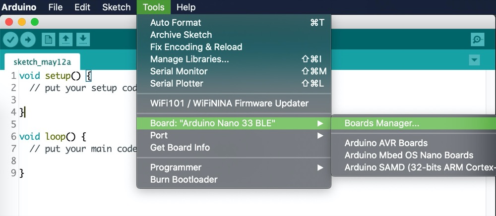
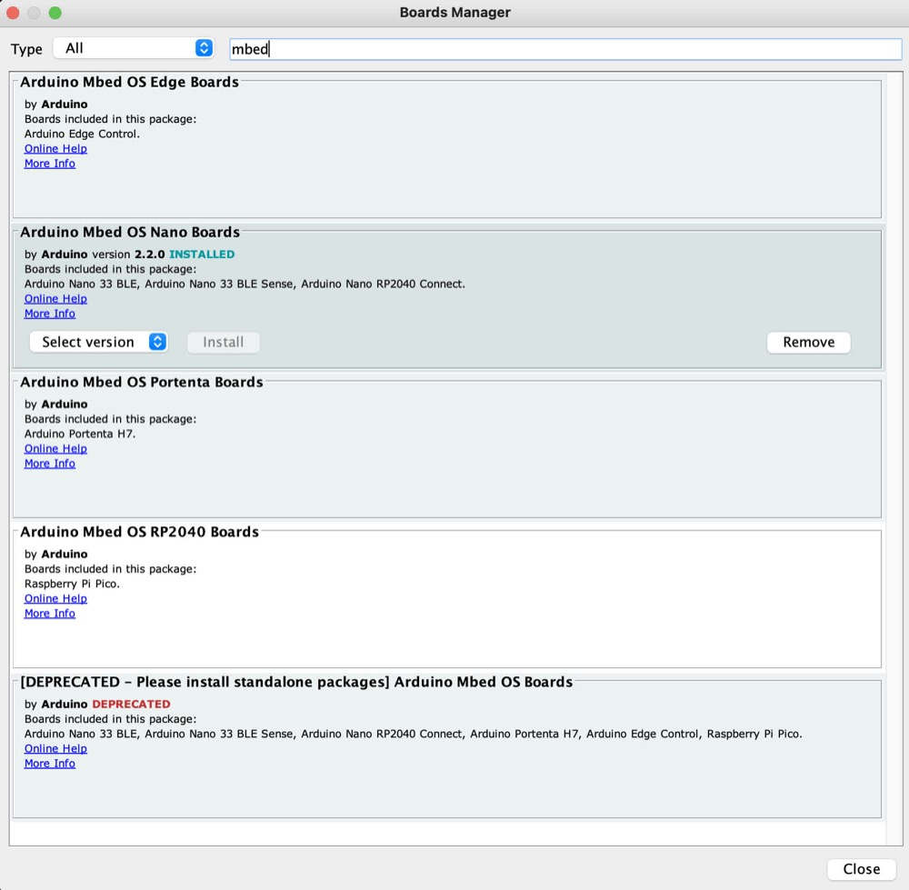
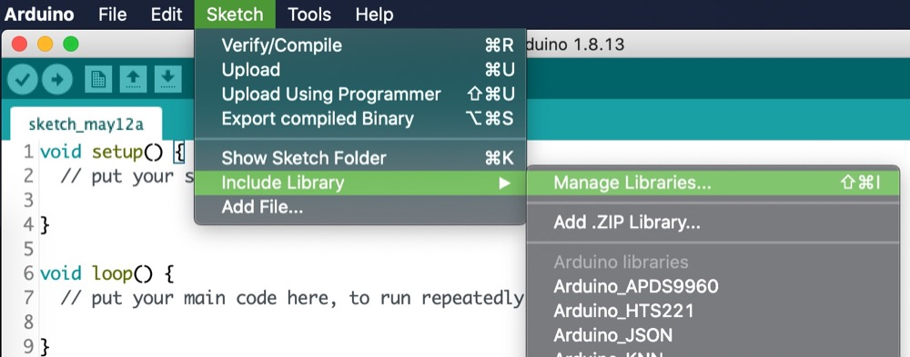
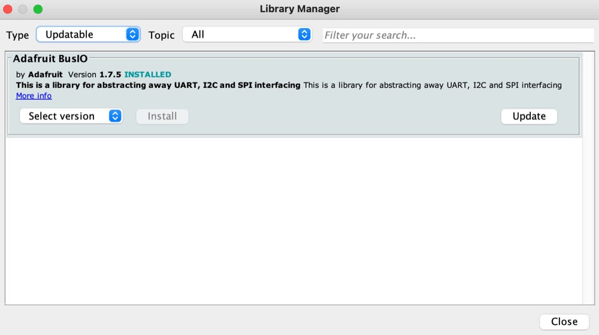
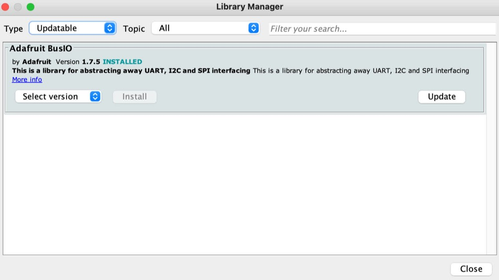
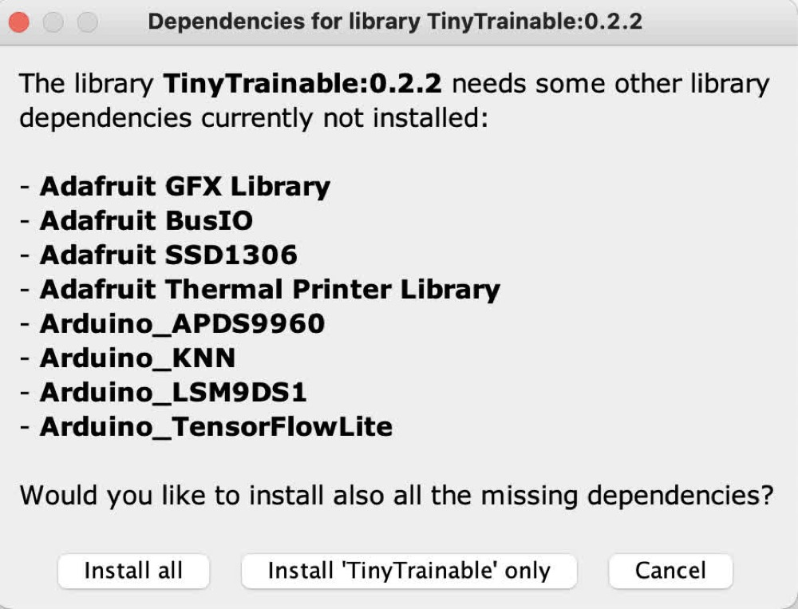
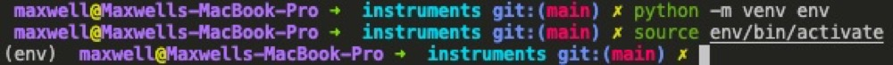

# Installation

Hi! Welcome to our installation guide, we're super glad to have you here :)

This guide includes information as of June 2021, and we will explicitly include the software versions we are using.

We advise to install the same versions we are using, and if there is any issue with the library or related software, please us know via email or an issue the repository.

For additional documentation, please visit the official Arduino docs website at [docs.arduino.cc](https://docs.arduino.cc]), and in particular the documentation of the Arduino Nano 33 BLE Sense microcontroller at [docs.arduino.cc/hardware/nano-33-ble-sense](https://docs.arduino.cc/hardware/nano-33-ble-sense).

## Arduino IDE

Download and install the Arduino IDE, available at [https://www.arduino.cc/en/software](https://www.arduino.cc/en/software). Select the stable release corresponding to your computer's operating system.

As of June 2021, we are using Arduino IDE 1.8.15.

## Arduino Mbed OS Nano boards

After installing the Arduino IDE, we need to install the core and necessary libraries for the Arduino Nano 33 BLE Sense microcontroller. Open the Arduino IDE and navigate on the menu to the `Boards Manager`:

```Tools > Board: "<board_name>" > Boards Manager...```



Use the search bar to find the option `Arduino Mbed OS Nano Boards` and install it, this might take a while.

Please note that if you look for "Mbed", several different options will appear, be careful with the similar named one called `Arduino Mbed OS Boards` which is deprecated and we should not install.

As of June 2021, we are using version 2.2.0.



After the installation is complete, we can select the board we are going to work with (Arduino Nano 33 BLE), from the `Tools` menu:

```Tools > Board: "<board_name>" > Arduino Mbed OS Nano Boards > Arduino Nano 33 BLE```

Please note that this option is valid for both Arduino Nano 33 BLE, and for the board we are using, the Arduino Nano 33 BLE Sense.

## Arduino libraries

Before installing the TinyTrainable library for this project, please first update all your installed libraries. On the Arduino IDE, navigate on the menu to `Tools > Manage Libraries... >`, and then on the `Type` dropdown menu select `Updatable`.





To update each outdated library to their latest version, hover on top of each library, and click on the button `Update`. For this example we are showing the updating of the library Adafruit BusIO, which is installed on my computer, but most probably is not on yours, and you don't need it for this project either.



Please repeat this process until there are no updatable libraries left.

Next we will install all the libraries needed for this project. On the Arduino IDE, navigate on the menu to `Tools > Manage Libraries... >`


Go to the search bar of the Libraries Manager and type `TinyTrainable`. This installation will give you the option to also install its dependencies, select `Install all` to download them.



As of June 2021, the latest version 0.2.2 of the TinyTrainable library has these dependencies:

Libraries for using the embedded sensors of our microcontroller:

* `Arduino_APDS9960`: color, proximity
* `Arduino_LSM9DS1` acceleration, magnetic field, gyroscope orientation

Libraries for machine learning:

* `Arduino_KNN`: k-nearest neighbor algorithm.
* `Arduino_TensorFlowLite`: microcontroller version of the TensorFlow machine learning library. Please download the latest non-precompiled version.

Libraries for multimedia output:

* `Adafruit GFX Library`: for output with screen.
* `Adafruit SSD1306`: for output with screen.
* `Adafruit Thermal Printer Library`: for output with thermal printer.
* `Servo`: for output with servo motors.

## Python for machine learning

For input-color, you only need Arduino libraries.

For input-gesture and speech, you either need to install specific Python libraries on your computer, or use the free Google Colab service, because we will create databases and train algorithms on a computer.

For beginners, we suggest using Google Colab, because it will be an easier installation, and the algorithms will run faster.

If you decide to run the algorithms on your machine, you will need Python, TensorFlow and Jupyter.

These are the versions we will be using, as of June 2021:

* Python 3.8.6
* TensorFlow 2.3.2
* Jupyter Lab 3.0.5

Your computer might have Python already installed, but it might be one that is not compatible with the TensorFlow version we are using, so we suggest using a Python version manager, like the tool pyenv [https://github.com/pyenv/pyenv](https://github.com/pyenv/pyenv).

After installing pyenv, open the terminal and go to this repository. If you dont know how to download a repository to your machine, follow this [tutorial](https://docs.github.com/en/github/creating-cloning-and-archiving-repositories/cloning-a-repository-from-github/cloning-a-repository) about cloning repositories from GitHub.

```bash
cd tiny-trainable-instruments/
```

Check that pyenv is able to read the .python-version file

```bash
pyenv versions
```

You should see a list, with the version we are using and an asterisk, to highlight that this is the Python version we will use. If there is no asterisk and it says that the required version of Python is not installed, use the command:

```bash
pyenv install <python version number>
```

If you are using an old version of pyenv, there's a chance that the install won't work; copy the entire command pyenv gives you (including the &&'s) and enter it into the terminal. Then once pyenv is updated, try the above command again.

Now that you have the correct version of Python, create a virtual environment (which we will name env) using the Python package venv. Most dependency problems can be solved by using a virtualenv; we can’t support issues not using a virtualenv due to the huge variety of system configurations. On your terminal type:

```bash
python -m venv env
```

Activate the virtual environment with this command, which you will use every time you want to enter the venv:

```bash
source env/bin/activate
```

Now your terminal should have every new line starting with (env). Your command prompt should look something like this:

../docs/images/1-arduino-boards-manager



The pip of your Python virtual environment might need updating; you can update to the latest version with the command

```bash
pip install --upgrade pip
```

Then use pip to install the Jupyter packages, along with their dependencies:

```bash
pip install -r requirements.txt
```

Now you can run the Jupyter Lab tool with `jupyter-lab`. This will open a tab on your browser to navigate through the files in your computer and allow you run code and read the documentation.

The code for input-gesture and input-speech is written using Jupyter notebooks, which have the extension .ipynb, and are located on the folder `instruments/`. The documentation is written in several Markdown files with extension .md. These files are on the folder [`docs/`](../docs/), which includes an index on README.md.

If you double click on a Markdown file, it will open an Editor window with the Markdown code. To view the rendered text you can right click and select "Open with Markdown Preview". If you have internet connection, it might be more convenient to access the online documentation on the online repository.

To close the Jupyter notebook server, press `ctrl+c` in the terminal (even on OSX; it's not `cmd`) and confirm with `y`.

To exit the virtual environment once you're done, use the command `deactivate`. Note that the command `jupyter-lab` will not work until you reactive the virtual environment.
