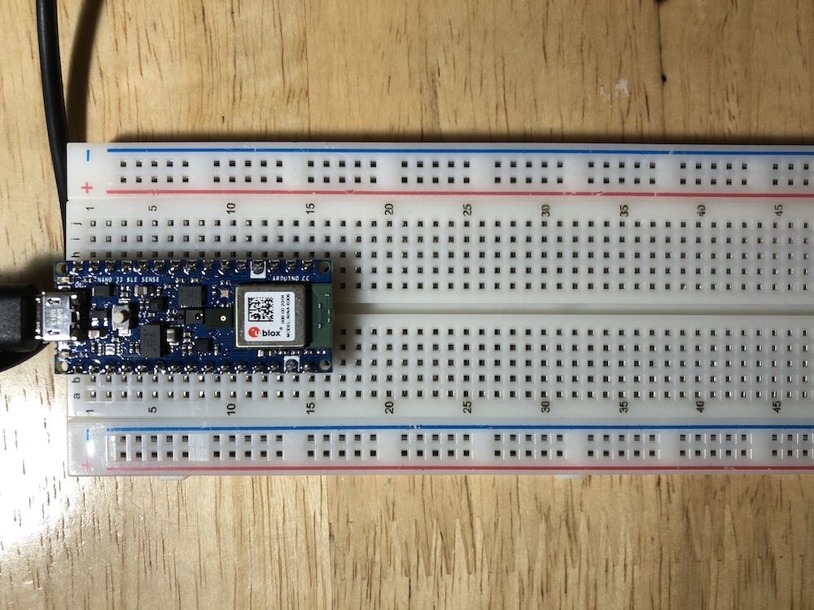
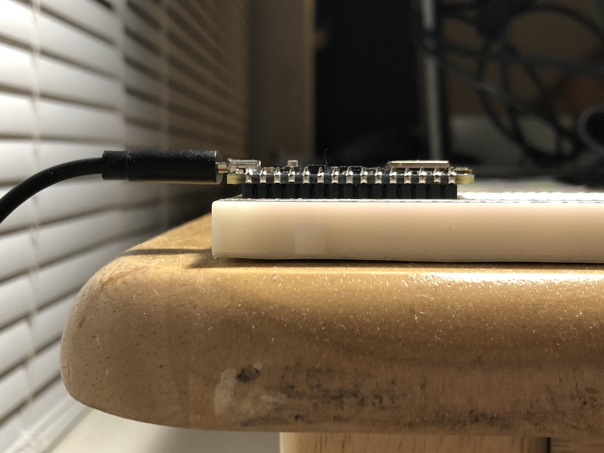
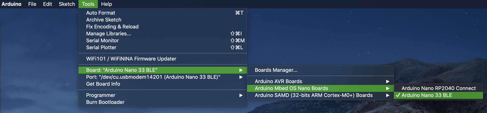
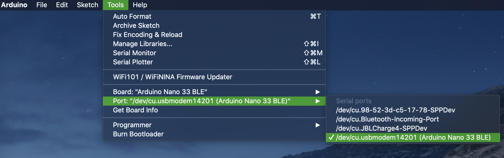
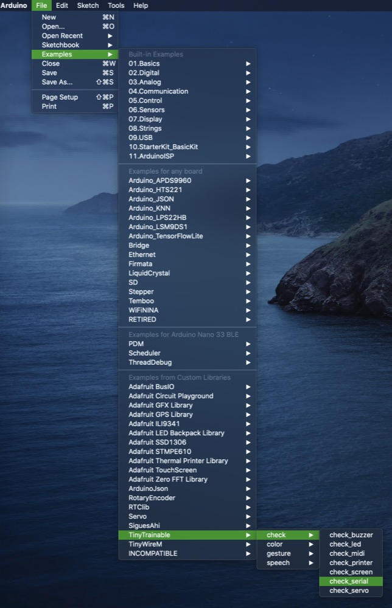
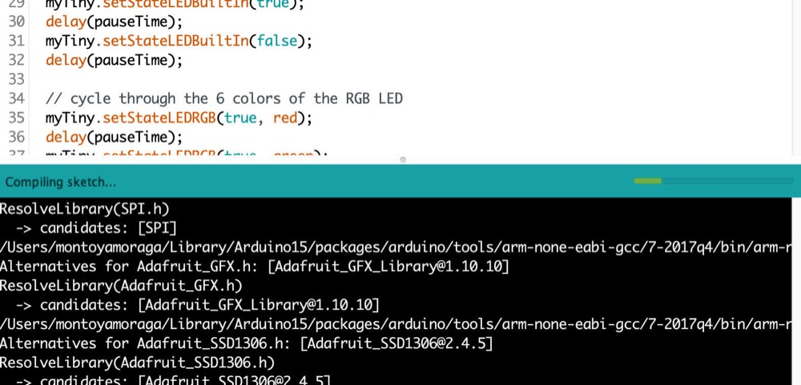
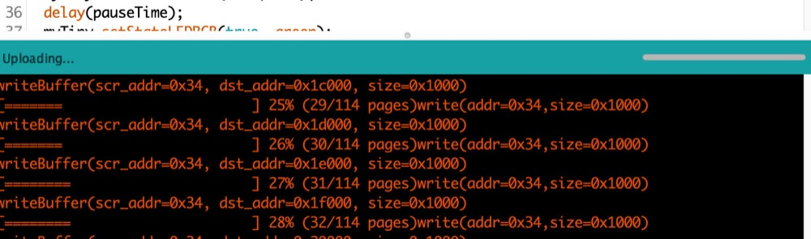
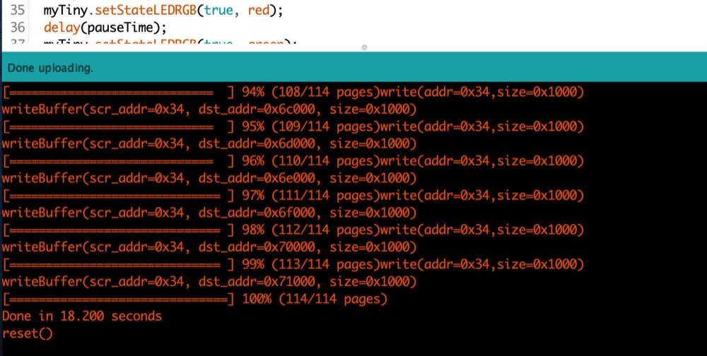
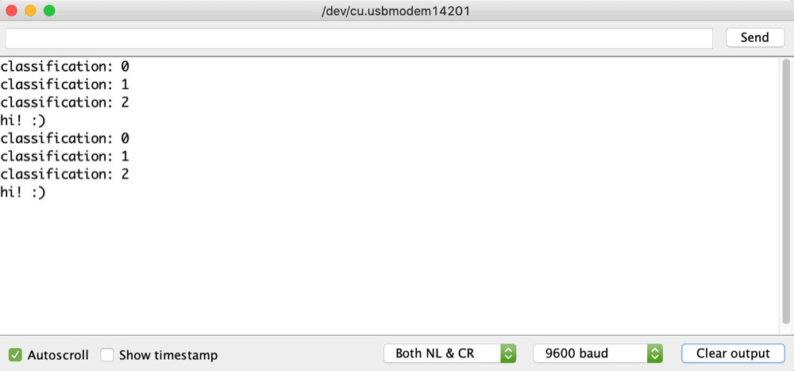
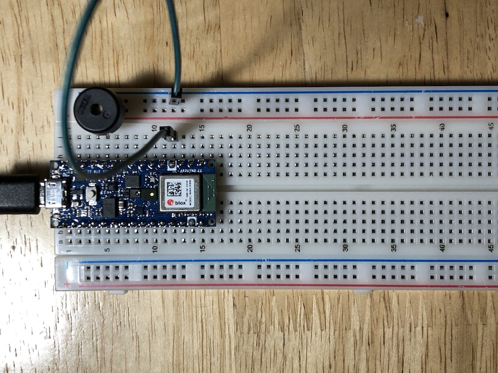

# Wiring

## Conventions

Wires:
* Red = 3.3 V power from Arduino
* Green = Ground from Arduino

## Breadboard

Breadboards are built so that within each of the rows, the 5 tie points in the columns labelled "a-e" are electrically connected inside the board and act as a single electrical node, and same with f-j. In addition, there are two columns to each side of the breadboard; for a fullsize breadboard like we recommend, the top 25 tie points of each column are connected, and the bottom 25 tie points of each column are connected. Conventionally, we connect the positive terminal to the columns labelled `+`, and the ground to the columns labelled `-`.

A full breadboard guide is available at [https://learn.adafruit.com/breadboards-for-beginners/breadboards](https://learn.adafruit.com/breadboards-for-beginners/breadboards).

## Arduino microcontroller

The Nano BLE 33 Sense has 30 pins in total, 15 on each side. The official pinout is available at [https://content.arduino.cc/assets/Pinout-NANOsense_latest.pdf](https://content.arduino.cc/assets/Pinout-NANOsense_latest.pdf).

We recommend placing the microcontroller at the top of the breadboard (C1 to G15) with the USB Micro B port facing up, like this:



Note that the microcontroller should be flush with the breadboard; none of the headers should be visible!



## Your first example

Connect your Arduino microcontroller to your computer with the USB cable and open the Arduino IDE software.

On the board, select the ```Arduino Nano 33 BLE```.



Then, make sure yor port points to your Arduino, the number is irrelevant, and the actual text changes between computers.



Now let's open the example ```check_serial```, included with our TinyTrainable library.



Click on the arrow to the right for uploading the code, which will be shown on the bottom of the Arduino IDE, with the message ```Compiling sketch```.



The compilation might take several minutes, and after it is done, the message will change to ```Uploading...```



This process is shorter, and after it you will see the message ```Done uploading```.



On the upper right corner of the window, click on the magnifying glass icon for opening the ```Serial monitor```, which will looks like this.



Make sure the settings on the bottom match the ones on your computer, and that's it :)

You uploaded your first example to your Arduino, which is now busy sending the messages you seen on the screen, and also showing all the different lights it has :)

## Outputs

### Buzzer

For the next example, check_buzzer, we'll need to install a piezo buzzer. First, notice that the 14th pin on the left side and the 12th pin on the right side are labelled with white paint; this marks ground, also identified on the pinout. Take a wire (preferably green by convention for ground) and connect it from I12 to anywhere on the top righthand negative rail (the upper 25 pins), like this:



Next, connect one of the legs of the piezo buzzer to the node labelled D8 on the pinout (which should be row 5 on the breadboard). Connect the other leg to the ground rail. Your wiring should look like this:


Now you're good to go! Upload ```check_buzzer``` to the microcontroller, open the serial monitor (top right button in the Arduino IDE), and follow the instructions from there!

### LED

### MIDI

MIDI Din jack

5 pins, only 3 are used.

### Printer

We are using a thermal printer from Adafruit.

https://www.adafruit.com/product/2753

It has 5 cables:

VH - red - connect to the power supply 5V - 9V
DTR - yellow - connect to GND on the Arduino
TX - green - data out of the printer
RX - blue - data in to the printer
GND - black - connect to GND on the Arduino

We use a power supply, whose ground  is connected to the one on the Arduino.

The power supply is 9V, center positive.
Here is one available:
https://www.adafruit.com/product/276

### Serial

With a serial cable into a computer.
