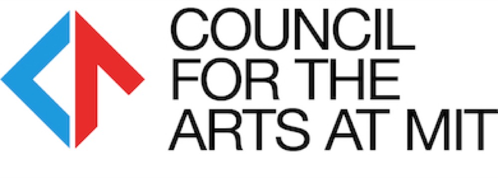

# Workshop

## About

This workshop has been written and designed by Aarón Montoya-Moraga in 2021, as a research assistant and master's student at MIT Media Lab's Opera of the Future and Future Sketches research groups. Additional code, examples, and documentation by MIT undergraduate researchers Peter Tone and Maxwell Wang.

## Key concepts

Machine learning, media arts, Arduino microcontroller, tiny machine learning.

## Code of conduct

* [Berlin Code of Conduct](https://berlincodeofconduct.org/)
* [p5.sj community statement](https://p5js.org/community/)

## Materials

You would need to bring a computer, with Linux, Mac or Windows operating systems.

This workshop is taught online over teleconferencing.

## First session

Goals:

* Address doubts about installation of Arduino software and libraries
* Understand the check_ examples for testing wiring

Code used:

* check_serial: 
* check_buzzer

Hardware:

* Breadboard
* Arduino

Activities:

* 10min: introduction to workshop and instructor
* 10min: participants introduce themselves
* 20min: installation of Arduino IDE and libraries
* 10min: compile and upload first example, check_serial
* 10min: read the code example and make modifications
* 10min: example with buzzer, compile and read check_buzzer
* 10min: wire buzzer and play with different frequencies on check_buzzer
* 05min: break
* 10min: compile and read machine learning example: color_buzzer
* 10min: explain training for color_buzzer
* 10min: participants modify the color_buzzer example

Extras:

* Capture examples of gesture and train overnight
* Capture examples of speech and train overnight

## Second session

## Funding

Funded by the Council for the Arts at MIT, including 

## Contact

Email velouria@media.mit.edu or submit an issue at the repository https://github.com/montoyamoraga/tiny-trainable-instruments/
