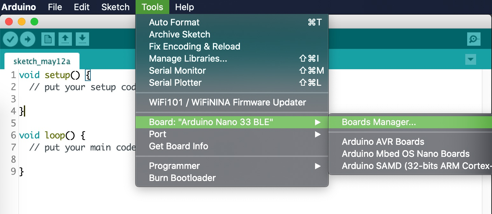
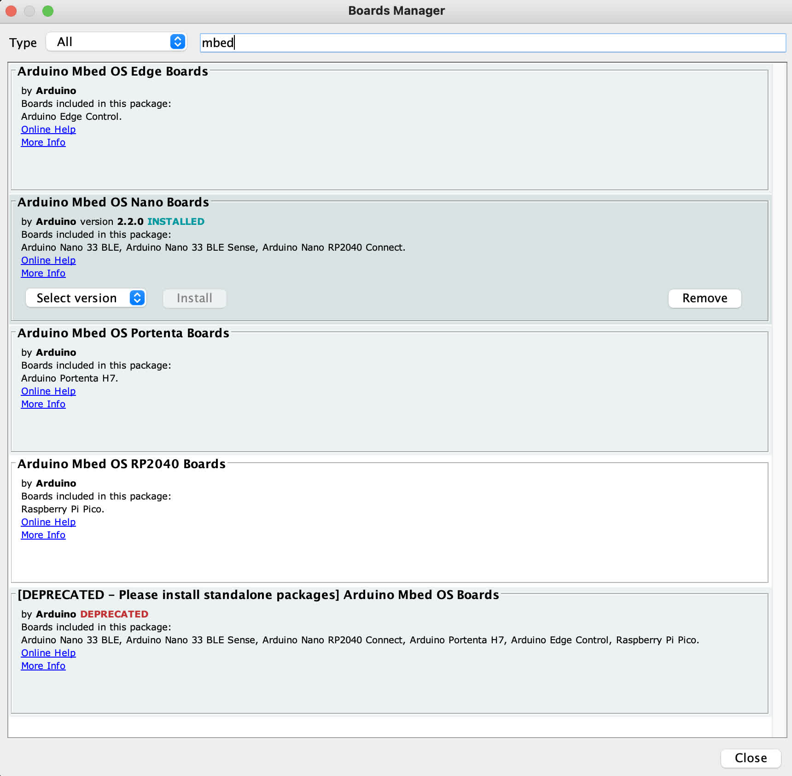
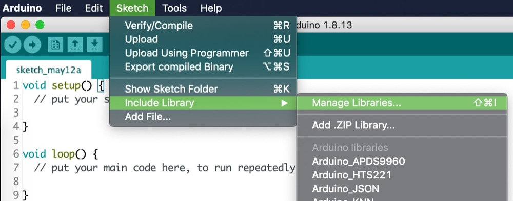
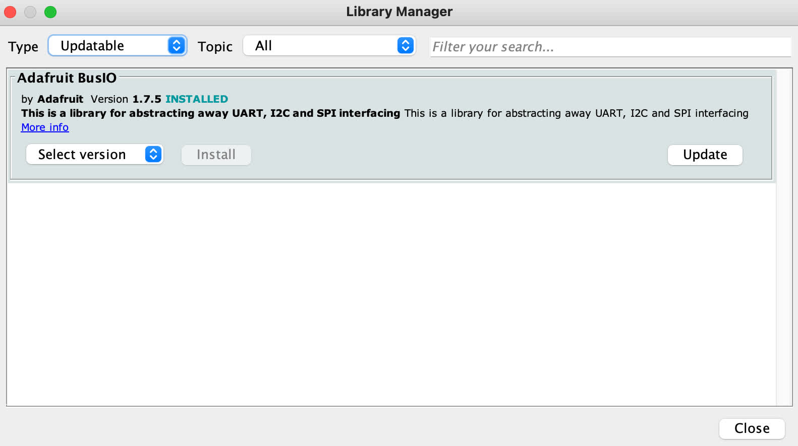
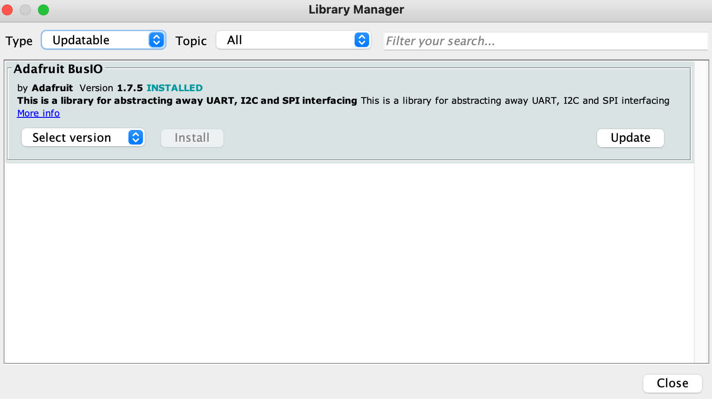
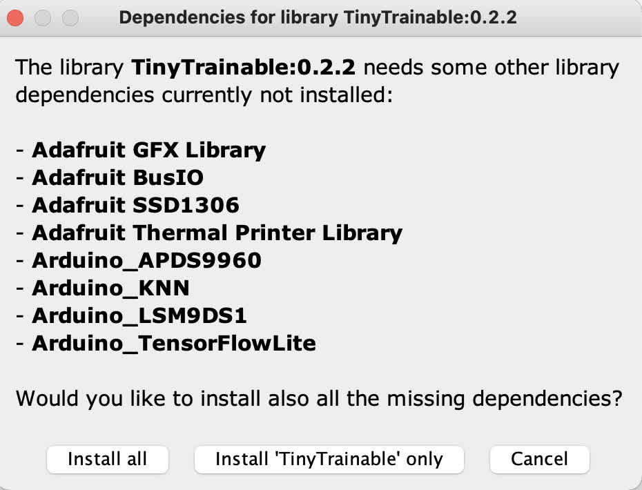
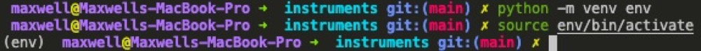

# Instalación

Hola! Esta es nuestra guía de instalación, bienvenides :)

Esta guía incluye información actualizada en junio 2021, y estaremos incluyendo explícitamente las versiones de los software que estamos usando.

Recomendamos instalar las mismas versiones que estamos usando, y si hay un problema con la biblioteca o software relacionado, por favor haznos saber por correo electrónico o el sistema de reportes del repositorio.

Para documentación adicional, por favor visita el sitio web oficial de documentación de Arduino en [docs.arduino.cc](https://docs.arduino.cc]),y en particular la documentación del microcontrolador Arduino Nano 33 BLE Sense en [docs.arduino.cc/hardware/nano-33-ble-sense](https://docs.arduino.cc/hardware/nano-33-ble-sense).

## Arduino IDE

Descarga e instala el software Arduino IDE, disponible en [https://www.arduino.cc/en/software](https://www.arduino.cc/en/software). Selecciona el lanzamiento estable (stable release) correspondiente al sistema operativo de tu computador.

En junio 2021, estamos usando Arduino IDE 1.8.15.

## Arduino Mbed OS Nano boards

Después de instalar el software Arduino IDE, necesitamos instalar bibliotecas para nuestro microcontrolador Arduino Nano 33 BLE Sense. Abre la Arduino IDE y navega en el menú al `Boards Manager`:

```Tools > Board: "<board_name>" > Boards Manager...```



Usa la barra de búsqueda para encontrar la opción `Arduino Mbed OS Nano Boards` e instálala, esto puede tomar un tiempo largo.

Por favor nota que si buscas "Mbed" aparecen muchas opciones, ten mucho cuidado con la opción que tiene un nombre similar, llamada `Arduino Mbed OS Boards`, que es una versión anterior que no debemos instalar.

En junio 2021, estamos usando la versión 2.2.0.



Después de que la instalación está lista, podemos seleccionar el microcontrolador que vamos a utilizar (Arduino Nano 33 BLE), desde el menú `Tools`:

```Tools > Board: "<board_name>" > Arduino Mbed OS Nano Boards > Arduino Nano 33 BLE```

Por favor nota que esta opción es válida para el microcontrolador Arduino Nano 33 BLE, y para el que estamos usando, Arduino Nano 33 BLE Sense.

## Bibliotecas Arduino

Antes de instalar la biblioteca TinyTrainable para este proyecto, primero actualizaremos todas tus biblitoecas instaladas. En la Arduino IDE, navega en el menú a `Tools > Manage Libraries... >`, y luego en la sección `Type` elige en el menú la opción `Updatable`.





Para actualizar cada biblioteca a su versión más nueva, ubica tu cursos sobre cada biblioteca, y haz click en el botón `Update`. En este ejemplo se muestra como ejemplo la actualización de la biblioteca Adafruit BusIo, que tengo instalada en mi computadora, pero lo más probable es que tú no la tengas ni la necesites.



Por favor repite este proceso hasta que todas tus bibliotecas estén actualizadas.

A continuación instalaremos todas las bibliotecas necesarias para este proyecto. En la Arduino IDE, navega en el menú a `Tools > Manage Libraries... >`


Usa la barra de búsqueda del Libraries Manager para encontrar `TinyTrainable`. Esta instalación te dará la opción de también instalar todas sus dependencias, selecciona `Install all` para también descargarlas.



En junio 2021, la versión 0.2.2 es la más reciente de la biblioteca TinyTrainable, y tiene estas dependencias:

* Bibliotecas para usar los sensores del microcontrolador:
  * `Arduino_APDS9960`: color, proximidad
  * `Arduino_LSM9DS1` aceleración, campo magnético, orientación giroscopio

* Bibliotecas para aprendizaje de máquinas:
  * `Arduino_KNN`: algoritmo vecino de cercanía k.
  * `Arduino_TensorFlowLite`: versión para microcontroladores de la biblioteca TensorFlow de aprendizaje de máquinas. Por favor descarga la versión no-precompilada más reciente.

* Bibliotecas para salida multimedia:
  * `Adafruit GFX Library`: para salida con pantalla.
  * `Adafruit SSD1306`: para salida con pantalla.
  * `Adafruit Thermal Printer Library`: para salida con impresora térmica.
  * `Servo`: para salida con motores servo.

## Python for machine learning

For input-color, you only need Arduino libraries.

For input-gesture and speech, you either need to install specific Python libraries on your computer, or use the free Google Colab service, because we will create databases and train algorithms on a computer.

For beginners, we suggest using Google Colab, because it will be an easier installation, and the algorithms will run faster.

If you decide to run the algorithms on your machine, you will need Python, TensorFlow and Jupyter.

These are the versions we will be using, as of June 2021:

* Python 3.8.6
* TensorFlow 2.3.2
* Jupyter Lab 3.0.5

Your computer might have Python already installed, but it might be one that is not compatible with the TensorFlow version we are using, so we suggest using a Python version manager, like the tool pyenv [https://github.com/pyenv/pyenv](https://github.com/pyenv/pyenv).

After installing pyenv, open the terminal and go to this repository. If you dont know how to download a repository to your machine, follow this [tutorial](https://docs.github.com/en/github/creating-cloning-and-archiving-repositories/cloning-a-repository-from-github/cloning-a-repository) about cloning repositories from GitHub.

```bash
cd tiny-trainable-instruments/
```

Check that pyenv is able to read the .python-version file

```bash
pyenv versions
```

You should see a list, with the version we are using and an asterisk, to highlight that this is the Python version we will use. If there is no asterisk and it says that the required version of Python is not installed, use the command:

```bash
pyenv install <python version number>
```

If you are using an old version of pyenv, there's a chance that the install won't work; copy the entire command pyenv gives you (including the &&'s) and enter it into the terminal. Then once pyenv is updated, try the above command again.

Now that you have the correct version of Python, create a virtual environment (which we will name env) using the Python package venv. Most dependency problems can be solved by using a virtualenv; we can’t support issues not using a virtualenv due to the huge variety of system configurations. On your terminal type:

```bash
python -m venv env
```

Activate the virtual environment with this command, which you will use every time you want to enter the venv:

```bash
source env/bin/activate
```

Now your terminal should have every new line starting with (env). Your command prompt should look something like this:

../docs/images/1-arduino-boards-manager



The pip of your Python virtual environment might need updating; you can update to the latest version with the command

```bash
pip install --upgrade pip
```

Then use pip to install the Jupyter packages, along with their dependencies:

```bash
pip install -r requirements.txt
```

Now you can run the Jupyter Lab tool with `jupyter-lab`. This will open a tab on your browser to navigate through the files in your computer and allow you run code and read the documentation.

The code for input-gesture and input-speech is written using Jupyter notebooks, which have the extension .ipynb, and are located on the folder `instruments/`. The documentation is written in several Markdown files with extension .md. These files are on the folder [`docs/`](../../docs/), which includes an index on README.md.

If you double click on a Markdown file, it will open an Editor window with the Markdown code. To view the rendered text you can right click and select "Open with Markdown Preview". If you have internet connection, it might be more convenient to access the online documentation on the online repository.

To close the Jupyter notebook server, press `ctrl+c` in the terminal (even on OSX; it's not `cmd`) and confirm with `y`.

To exit the virtual environment once you're done, use the command `deactivate`. Note that the command `jupyter-lab` will not work until you reactive the virtual environment.
